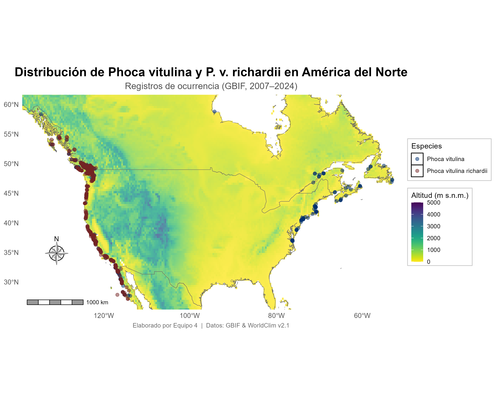
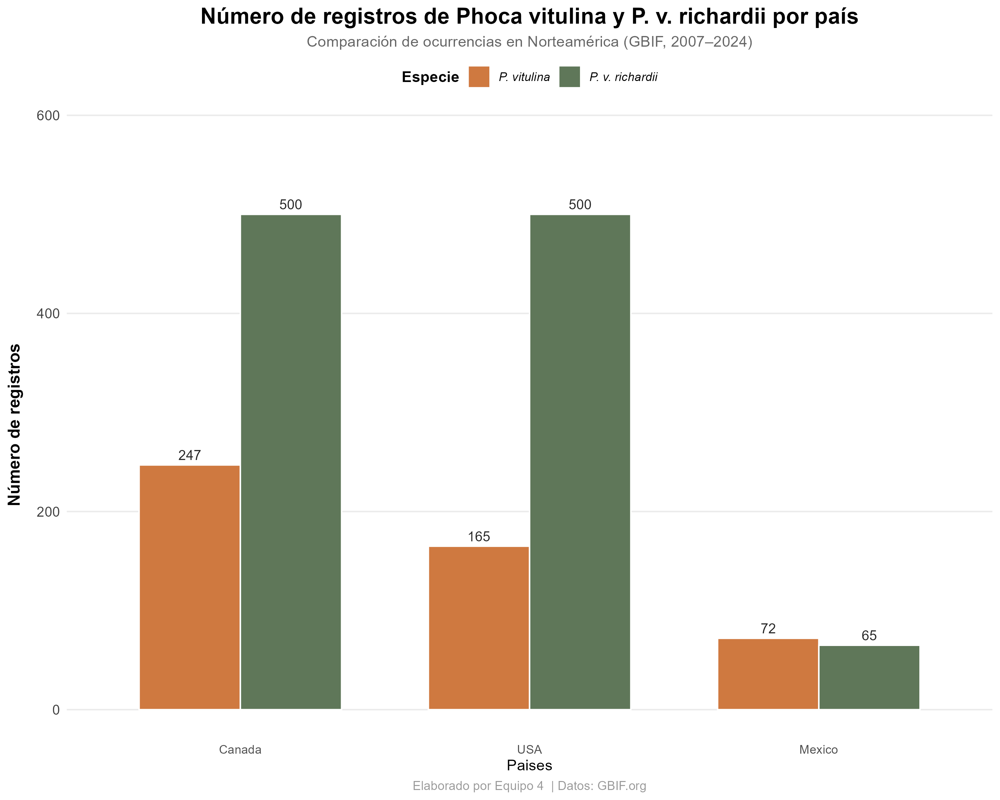
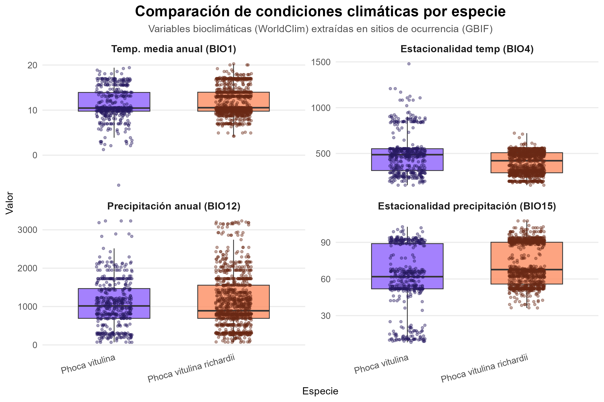
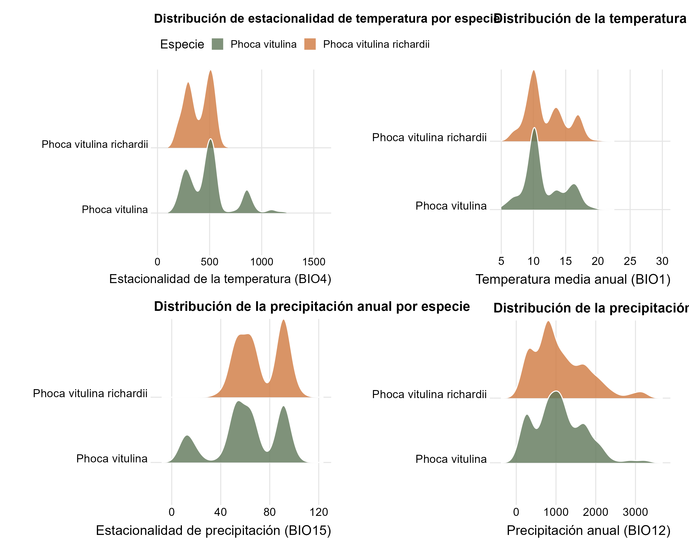
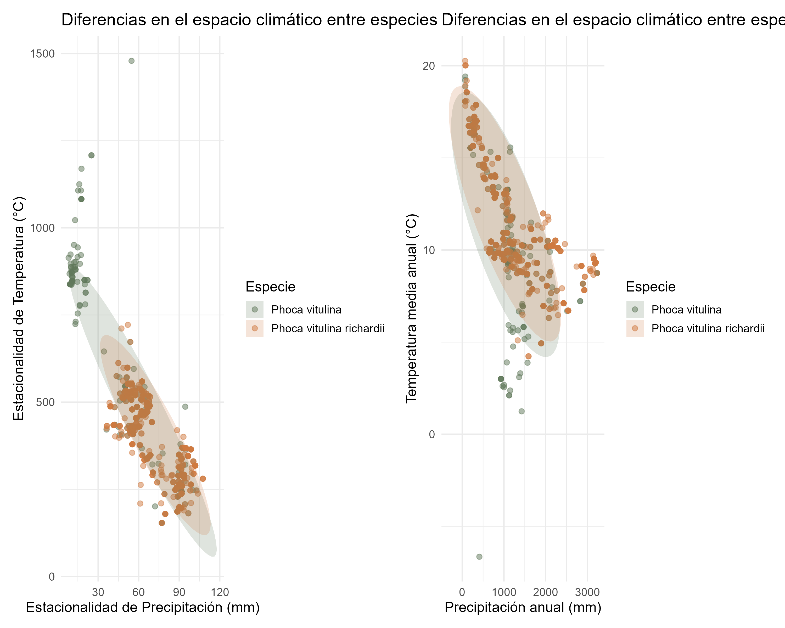

```{css, echo=FALSE}
/* Justificación del texto */
body {
  text-align: justify;
  text-justify: inter-word;
}

p, li {
  text-align: justify;
  text-justify: inter-word;
  line-height: 1.6;
}

h1, h2, h3, h4, h5, h6 {
  text-align: left;
}

.figure {
  text-align: center;
}

.fig-caption {
  text-align: center;
  font-style: italic;
  color: #666;
}
```

{width="457"}

::: {style="background: linear-gradient(135deg, #667eea 0%, #764ba2 100%); color: white; padding: 25px; border-radius: 10px; box-shadow: 0 4px 6px rgba(0,0,0,0.1);"}
**🧪 Proyecto Académico**

**👨‍🏫 Profesores responsables:**\
Pingarroni Martín del Campo Aline\
Auliz Ortiz Daniel Martín

**👥 Integrantes del Equipo 4:**\
Alvarado Mota Jonatan Martín\
Rojas Frías Ximena\
Velazquez Rivera Gael Jesus

**📚 Licenciatura en Ecología**\
**🏛️ Facultad de Estudios Superiores Iztacala**\
**📅 28 de octubre de 2025**
:::

------------------------------------------------------------------------

# **Introducción**

La distribución espacial de los mamíferos marinos es un componente clave para comprender su ecología, comportamiento y vulnerabilidad ante el cambio ambiental. En particular, *Phoca vitulina* y su subespecie *Phoca vitulina richardii* presentan patrones de ocurrencia estrechamente ligados a zonas costeras de baja altitud, lo que las convierte en bioindicadores sensibles de la salud de los ecosistemas marinos (Morales, 2014). Estudiar su presencia en distintas regiones de América del Norte permite identificar áreas críticas de conservación, evaluar desplazamientos poblacionales y anticipar respuestas ecológicas ante presiones antropogénicas. (Nuche, 2012).\
\
El cambio climático representa una amenaza creciente para los mamíferos marinos, incluyendo *Phoca vitulina*, cuyas poblaciones dependen de condiciones costeras estables y accesibles. El incremento de la temperatura del océano, la reducción de hielo marino y las alteraciones en la disponibilidad de presas están modificando sus patrones de distribución, reproducción y comportamiento migratorio (Díaz Cordero, 2012). Estos factores pueden provocar desplazamientos hacia nuevas áreas, aumentar la competencia inter-específica y reducir la viabilidad de ciertas poblaciones, especialmente en los límites de su rango geográfico. Comprender estas dinámicas es esencial para anticipar escenarios ecológicos futuros y diseñar estrategias de conservación adaptativas.

[](https://inaturalist-open-data.s3.amazonaws.com/photos/318367039/large.jpg)


En este contexto, el lenguaje de programación R se ha consolidado como una herramienta poderosa para el análisis de datos ecológicos, permitiendo la visualización geoespacial, la generación de gráficos dinámicos y la integración de fuentes como GBIF y WorldClim. Su aplicación agiliza el manejo de grandes conjuntos de datos y fomenta la transparencia metodológica, aspectos esenciales en la investigación de la biodiversidad (Beckerman et al., 2017)

La creciente disponibilidad de datos abiertos sobre biodiversidad exige métodos analíticos robustos y accesibles que permitan extraer patrones ecológicos significativos. El estudio de la distribución de *Phoca vitulina* en Canadá, Estados Unidos y México no solo aporta información sobre sus preferencias de hábitat, sino que también permite evaluar los límites ecológicos de la especie y detectar posibles cambios en su rango geográfico (Nuche, 2012). Utilizar R para procesar y visualizar estos datos garantiza un enfoque reproducible, transparente y adaptable a distintos contextos de investigación y conservación (Morales, 2014; Beckerman et al., 2017). 

Por lo tanto, el presente trabajo tiene como objetivo examinar la distribución geográfica y altitudinal de *Phoca vitulina* y la subespecie *P. v*. *richardii* en América del Norte entre 2007 y 2024, utilizando herramientas de visualización y análisis espacial en R, evaluando su relación con variables climáticas clave con el fin de identificar patrones ecológicos relevantes y contribuir al diseño de estrategias de conservación basadas en evidencia.

## **Pregunta de investigación**

¿Existen diferencias en las condiciones bioclimáticas de los sitios donde se registran Phoca vitulina y Phoca vitulina richardii en Norte América?

## **Variables a considerar**

**GBIF:**

-   Sitios de ocurrencia de *P. vitulina* y *P.v. richardii* en Norte América (MX, CA, US)

Una ocurrencia es la evidencia de que una especie (u otro taxón) estaba en un lugar específico en una fecha específica

**WorldClim**:

-   [Bio_01:]{.underline} Temperatura media anual

-   [Bio_04:]{.underline} Estacionalidad de la temperatura (desviación estándar ×100)

-   [Bio_12:]{.underline} Precipitación anual

-   [Bio_15:]{.underline}  Estacionalidad de la precipitación (coeficiente de variación)

------------------------------------------------------------------------

# **Bases de datos**

Para la realización de este proyecto se utilizaron dos fuentes principales:

-   ***GBIF (Global Biodiversity Information Facility)\
    ***Plataforma internacional de acceso abierto que concentra registros de presencia de especies a partir de museos, monitoreos e instituciones científicas. Esta permite facilitar el acceso a datos georreferenciados de biodiversidad a escala global. Los datos a emplear fueron: registros con coordenadas geográficas de Phoca vitulina y Phoca vitulina richardii en México, Canadá y Estados Unidos

    -   Variables relevantes:

        -   decimalLatitude, decimalLongitude (coordenadas geográficas)

        -   eventDate (fecha de observación)

        -   species (especie)

        -   scientificName (nombre científico completo)

        -   basisOfRecord, institutionCode (fuente del registro)

            Enlace: <https://www.gbif.org/>\

-   ***WorldClim versión 2.1*****\
    **Base de datos mundial de variables climáticas derivadas de promedios de temperatura y precipitación (1970–2000). Es util pues una de sus funciones es proveer capas raster de variables bioclimáticas para modelar distribuciones de especies.

    -   Variables relevantes:

        -   bio1 = temperatura media anual

        -   bio12 = precipitación anual

        -   bio4 = estacionalidad de la temperatura

        -   bio15 = estacionalidad de la precipitación\
            Enlace: <https://www.worldclim.org/data/worldclim21.html>

Ambas bases se integrarán en R mediante los paquetes rgbif y terra, extrayendo las variables climáticas correspondientes a cada punto de presencia.

## **Exploración y transformación de bases de datos**

**PASO 1: Librerias**

```{r librerias, message=FALSE, warning=FALSE}
#Paquetes a utilizar
library(rgbif) #descargar datos de ocurrencias
library(tidyverse) #procesamiento de datos
library(sf) #manipulación  de datos vectoriales
library(rworldxtra) #datos vectoriales de los paises del mundo
library(geodata) #datos geoespaciales complemenatarios
library(ggspatial)#auxiliar para visualizar datos espaciales
library(terra) #datos raster
library(tidyterra) #maniipulación de raster
library(paletteer) #colores
library(ggcorrplot) #diagrama de correlaciones
library(ggridges) #gráfico de ridges
library(plotly) #gráficos avanzados
library(patchwork) #organizar gráficos
library(magick) #para manejo de imagenes
library(grid) #organizar y escribir múltiples grobs en un dispositivo gráfico e incluir tablas en objetos gráficos de cuadrícula
library(cowplot) #funciones que facilitan la anotación de gráficos o su combinación con imágenes
library(rlang) #proporciona varias interfaces para trabajar con R y objetos R
```

**PASO 2: Extraer datos de focas de cada país de Norte América de GBIF**

```{r message=FALSE, warning=FALSE}
#Vitulina MX
foca1mx <- occ_search(scientificName = "Phoca vitulina Linnaeus", 
                      hasCoordinate = TRUE, 
                      hasGeospatialIssue = FALSE,
                      country = "MX"
)$data

foca1mx <- foca1mx %>% 
  filter(scientificName == "Phoca vitulina Linnaeus, 1758") #eliminar subespecie

#richardii MX
foca2mx <- occ_search(scientificName = "Phoca vitulina richardii", 
                      hasCoordinate = TRUE, 
                      hasGeospatialIssue = FALSE,
                      country = "MX"
)$data
##verificar que los datos sean unicamente de mx
unique(foca1mx$countryCode)
unique(foca2mx$countryCode)

#Vitulina CA
foca1ca <- occ_search(scientificName = "Phoca vitulina Linnaeus ", 
                      hasCoordinate = TRUE, 
                      hasGeospatialIssue = FALSE,
                      country = "CA"
)$data
foca1ca <- foca1ca %>% 
  filter(scientificName == "Phoca vitulina Linnaeus, 1758") #eliminar subespecie

#richardii CA
foca2ca <- occ_search(scientificName = "Phoca vitulina richardii", 
                      hasCoordinate = TRUE, 
                      hasGeospatialIssue = FALSE,
                      country = "CA"
)$data

###verificar que los datos sean unicamente de ca
unique(foca1ca$countryCode)
unique(foca2ca$countryCode)

#Vitulina US
foca1us <- occ_search(scientificName = "Phoca vitulina Linnaeus ", 
                      hasCoordinate = TRUE, 
                      hasGeospatialIssue = FALSE,
                      country = "US"
)$data
foca1us <- foca1us %>% 
  filter(scientificName == "Phoca vitulina Linnaeus, 1758")
#richardii US
foca2us <- occ_search(scientificName = "Phoca vitulina richardii", 
                      hasCoordinate = TRUE, 
                      hasGeospatialIssue = FALSE,
                      country = "US"
)$data

###verificar que los datos sean unicamente de us
unique(foca1us$countryCode)
unique(foca2us$countryCode)
```

-   **Añadir columna para indicar país en cada base**

```{r message=FALSE, warning=FALSE}
foca1mx <- foca1mx %>% mutate(country = "Mexico", species = "Phoca vitulina Linnaeus")
foca1ca <- foca1ca %>% mutate(country = "Canada", species = "Phoca vitulina Linnaeus")
foca1us <- foca1us %>% mutate(country = "USA", species = "Phoca vitulina Linnaeus")

foca2mx <- foca2mx %>% mutate(country = "Mexico", species = "Phoca vitulina")
foca2ca <- foca2ca %>% mutate(country = "Canada", species = "Phoca vitulina")
foca2us <- foca2us %>% mutate(country = "USA", species = "Phoca vitulina")
```

-   **Unir bases de cada país por foca (P. vitulina y P. v. richardii**

```{r message=FALSE, warning=FALSE}
foca1_NorteA <- bind_rows(foca1mx, foca1ca, foca1us)
foca2_NorteA <- bind_rows(foca2mx, foca2ca, foca2us)
```

-   **Añadir columna con spp y subespecie**

```{r message=FALSE, warning=FALSE}
foca1_NorteA <- foca1_NorteA %>% mutate(species = "Phoca vitulina ")
foca2_NorteA <- foca2_NorteA %>% mutate(species = "Phoca vitulina richardii")

```

**PASO 3: Filtrar bases de datos de focas**

-   **Por tipo de registro:**

    ```{r}
    ##para phoca vitulina
    unique(foca1_NorteA$basisOfRecord)
    foca1_NorteA %>% 
      ggplot(aes(x= basisOfRecord, fill= basisOfRecord))+
      geom_bar()+
      coord_flip()+
      theme(legend.position = "none") 
    foca1_NorteA <- foca1_NorteA %>% 
      filter(basisOfRecord %in% c(c("HUMAN_OBSERVATION", "PRESERVED_SPECIMEN"))) #dejar unicamente observaciones humanas y especimenes preservados

    ##para phoca vitulina richardii
    unique(foca2_NorteA$basisOfRecord)
    foca2_NorteA %>% 
      ggplot(aes(x= basisOfRecord, fill= basisOfRecord))+
      geom_bar()+
      coord_flip()+
      theme(legend.position = "none") 
    foca2_NorteA <- foca2_NorteA %>% 
      filter(basisOfRecord %in% c(c("HUMAN_OBSERVATION", "PRESERVED_SPECIMEN"))) #dejar unicamente observaciones humanas y especimenes preservados
    ```

-   **Por institución de registro**

    ```{r}
    ##para phoca vitulina richardii
    unique(foca1_NorteA$institutionCode)

    foca1_NorteA %>% 
      ggplot(aes(x= institutionCode, fill= institutionCode))+
      geom_bar()+
      coord_flip()+
      theme(legend.position = "none") 
    #remover na
    foca1_NorteA <- foca1_NorteA %>% 
      filter(!is.na(institutionCode))

    ##para phoca vitulina richardii
    unique(foca2_NorteA$institutionCode)
    foca2_NorteA %>% 
      ggplot(aes(x= institutionCode, fill= institutionCode))+
      geom_bar()+
      coord_flip()+
      theme(legend.position = "none") 

    #como no hay ningún na no se eliminaron
    ```

**PASO 4: Transformar bases para usar en los mapas**

-   **Archivos SF de ocurrencias de focas**

    ```{r}
    foca1_NorteA_sf <- foca1_NorteA %>% 
      st_as_sf(coords = c("decimalLongitude", "decimalLatitude"), crs= 4326)

    foca2_NorteA_sf <- foca2_NorteA %>% 
      st_as_sf(coords = c("decimalLongitude", "decimalLatitude"), crs= 4326)
    ```

-   **Capa Raster y archivos vectoriales**

    ```{r}
    alt <- worldclim_global(var="elev", res=5, path=tempdir())
    data(countriesHigh) 
    Mundo <- st_as_sf(countriesHigh) 
    ```

**PASO 5: Extracción de bases de datos ambientales**

```{r}
env <- worldclim_global(var = "bio", res = 10, path = "datos_wc")
names(env)

#simplificar nombre de las variables
v_names <- vector()
for(i in 1:19){
  
  v_names[i] <- paste0("bio_", sprintf("%02d", i)) 
}

v_names

names(env) <- v_names

env
```

-   **Extraer datos en los puntos de ocurrencia de cada especie**

```{r message=FALSE, warning=FALSE}
foca1_NorteA_env <- extract(env, foca1_NorteA_sf)

foca1_NorteA_env$species <- c("Phoca vitulina")

foca2_NorteA_env <- extract(env, foca2_NorteA_sf)

foca2_NorteA_env$species <- c("Phoca vitulina richardii")
```

```{r message=FALSE, warning=FALSE}
## unir ambas bases
df_env <- bind_rows(foca1_NorteA_env, foca2_NorteA_env)
```

**PASO 6: Transformación de bases de datos para gráficos de exploración**

-   **Limpiar bases de datos para seleccionar variables deseadas para gráfico de numero de registros:**

    ```{r message=FALSE, warning=FALSE}
    #Seleccionar variables
    names(foca1_NorteA)
    foca1_abundancias <- foca1_NorteA %>%
      select(species, country, individualCount) %>%
      mutate(
        species = "Phoca vitulina",
        individualCount = ifelse(is.na(individualCount), 1, individualCount) #para poner cada observación 1 por 1
      )
    unique(foca1_abundancias$country)

    foca2_abundancias <- foca2_NorteA %>%
      select(species, country, individualCount) %>%
      mutate(
        species = "Phoca vitulina richardii",
        individualCount = ifelse(is.na(individualCount), 1, individualCount) #para poner cada observación 1 por 1
      )

    #Unificar ambas especies
    focas_abundancias <- bind_rows(foca1_abundancias,foca2_abundancias)

    #Confirmación de que se encuentran los datos necesarios de cada variable
    names(focas_abundancias)
    unique(focas_abundancias$species)
    unique(focas_abundancias$country)

    #Resumen de observaciones por país
    focas_resumen <- focas_abundancias %>%
      group_by(country, species) %>%
      summarise(n_obs = sum(individualCount, na.rm = TRUE)) %>%
      ungroup()

    ```

-   **Transformar bases de datos para gráfico boxplot**

    ```{r message=FALSE, warning=FALSE}
    # Preparar datos en formato largo
    box_df <- df_env %>%
      select(
        species,
        bio_01, # temp media anual
        bio_04, # estacionalidad temp
        bio_12, # precipitación anual
        bio_15  # estacionalidad precip
      ) %>%
      pivot_longer(
        cols = c(bio_01, bio_04, bio_12, bio_15),
        names_to = "variable",
        values_to = "valor"
      )

    # Etiquetas para facet
    etiquetas_vars <- c(
      "bio_01" = "Temp. media anual (BIO1)",
      "bio_04" = "Estacionalidad temp (BIO4)",
      "bio_12" = "Precipitación anual (BIO12)",
      "bio_15" = "Estacionalidad precipitación (BIO15)"
    )

    #Añadir etiquetas al df
    box_df$variable <- factor(
      box_df$variable,
      levels = names(etiquetas_vars),
      labels = etiquetas_vars
    )

    # Ordenar especies para que salgan siempre en el mismo orden visual
    box_df$species <- factor(
      box_df$species,
      levels = c("Phoca vitulina", "Phoca vitulina richardii")
    )
    ```

# **Mapas**

A continuación se presentan los mapas del sitio de estudio y la distribución de las especies seleccionadas

## **Mapa de sitio de estudio**

```{r message=FALSE, warning=FALSE}
mapa_NA_occ <- ggplot() +
  # Capa base: altitud
  geom_spatraster(data = alt, alpha = 0.8) +
  
  # Borde de países
  geom_sf(data = Mundo, fill = NA, color = "gray40", linewidth = 0.2) +
  
  # Capas vectoriales de focas
  geom_sf(data = foca1_NorteA_sf, aes(color = species), size = 2, alpha = 0.5) +
  geom_sf(data = foca2_NorteA_sf, aes(color = species), size = 2, alpha = 0.5) +
  
  # Zoom a Norte América
  coord_sf(xlim = c(-135, -55), ylim = c(27, 60)) +
  
  # Escala de altitud con paleta viridis 
  scale_fill_paletteer_c(
    "viridis::viridis",
    direction = -1,
    limits = c(0, 5000),
    na.value = "transparent",
    name = "Altitud (m s.n.m.)"
  ) +
  
  # Colores de especies
  scale_color_manual(
    values = c("#002F70","#742324"),
    
    name = "Especies"
  ) +
  # Etiquetas
  labs(
    title = "Distribución de Phoca vitulina y P. v. richardii en América del Norte",
    subtitle = "Registros de ocurrencia (GBIF, 2007–2024)",
    caption = "Elaborado por Equipo 4  |  Datos: GBIF & WorldClim v2.1"
  ) +
  
  #Rosa de los vientos
  annotation_north_arrow(
    location = "bl", which_north = "true",
    pad_x = unit(0.4, "in"), pad_y = unit(0.9, "in"),
    style = north_arrow_nautical(fill = c("white", "gray60"))
  ) +
  #Escala del mapa
  annotation_scale(
    location = "bl", bar_cols = c("gray60", "white"), text_family = "lato"
  ) +
  # Theme 
  theme_minimal(base_family = "lato") +
  theme(
    plot.title = element_text(size = 18, face = "bold", hjust = 0.5),
    plot.subtitle = element_text(size = 13, hjust = 0.5, color = "gray30"),
    plot.caption = element_text(size = 9, color = "gray40", hjust = 0.5),
    legend.position.inside = c(0.86, 0.25),
    legend.background = element_rect(fill = alpha("white", 0.8), color = "gray80"),
    legend.key = element_rect(fill = "transparent"),
    axis.text = element_text(size = 10),
    panel.grid = element_blank()
  )

print(mapa_NA_occ)
```

## **Mapas a diferentes escalas: Países del sitio de estudio**

**PASO 1:** **Crear función. Al introducir las coordenadas correspondientes a cada país (xmin,xmax,ymin,ymax) titulo y el nombre del archivo png de la bandera de cada país incluidos en la carpeta del proyecto (bandera_path) se crea el mapa a escala de cada país de norte américa**

```{r message=FALSE, warning=FALSE}
crear_mapa_pais <- function(xmin, xmax, ymin, ymax, titulo, bandera_path) {
  
  mapa <- ggplot() +
    # Capa de relieve
    geom_spatraster(data = alt, alpha = 0.7) +
    
    # Borde de países
    geom_sf(data = Mundo, fill = NA, color = "gray40", linewidth = 0.3) +
    
    # Capas vectoriales de ocurrencias de focas
    geom_sf(data = foca1_NorteA_sf, aes(color = species), size = 2, alpha = 0.9) +
    geom_sf(data = foca2_NorteA_sf, aes(color = species), size = 2, alpha = 0.9) +
    
    # Coordenadas del país para hacer zoom
    coord_sf(xlim = c(xmin, xmax), ylim = c(ymin, ymax)) +
    
    # Escala de altitud con paleta viridis y colores de cada especie
    scale_fill_paletteer_c("viridis::viridis", direction = -1, limits = c(0, 5000),
                           na.value = "transparent", name = "Altitud (m s.n.m.)") +
    scale_color_manual(values = c("#002F70","#742324"),
      name = "Especies") +
    
    # Escala del mapa y rosa de los vientos
    annotation_scale(location = "bl", bar_cols = c("gray60", "white"), text_family = "lato") +
    annotation_north_arrow(location = "bl", which_north = "true",
                           pad_x = unit(0.4, "in"), pad_y = unit(0.9, "in"),
                           style = north_arrow_nautical(fill = c("white", "gray60"))) +
    
    # Etiquetas
    labs(
      title = titulo,
      subtitle = "Registros de ocurrencia (GBIF, 2007–2024)",
      caption = "Elaborado por Equipo 4  |  Datos: GBIF & WorldClim v2.1"
    ) +
    
    theme_minimal() 
    
  # Agregar bandera
  bandera <- image_read(bandera_path)
  mapa_final <- ggdraw() +
    draw_plot(mapa) +
    draw_image(bandera, x = 0.82, y = 0.03, width = 0.16, height = 0.16)
  
  return(mapa_final)
}
```

**PASO 2:** **Crear mapa de cada país introduciendo los datos correspondientes**

-   **Mapa MX**

    ```{r message=FALSE, warning=FALSE}
    mapa_mx <- crear_mapa_pais(
      xmin = -120, xmax = -105, ymin = 22, ymax = 33,
      titulo = "Distribución de P. vitulina y P.v. richardii en México",
      bandera_path = "Bandera_mx.png"
    )
    print(mapa_mx)
    ## guardar mapa mx
    ggsave("mapa_mx.png", 
           mapa_mx, width = 10, height = 8, units = "in",
           bg="white",
           dpi = 300)
    ```

-   **Mapa US**

    ```{r message=FALSE, warning=FALSE}
    mapa_us <- crear_mapa_pais(
      xmin = -125, xmax = -65, ymin = 25, ymax = 50,
      titulo = "Distribución de P. vitulina y P.v. richardii en Estados Unidos",
      bandera_path = "Bandera_usa.png"
    )
    print(mapa_us)
    ## guardar mapa us 
    ggsave("mapa_us.png", 
           mapa_us, width = 10, height = 8, units = "in",
           bg="white",
           dpi = 300)
    ```

-   **Mapa CA**

    ```{r message=FALSE, warning=FALSE}
    mapa_ca <- crear_mapa_pais(
      xmin = -140, xmax = -50, ymin = 45, ymax = 70,
      titulo = "Distribución de P. vitulina y P.v. richardii en Canadá",
      bandera_path = "Bandera_ca.png"
    )
    print(mapa_ca)
    ## guardar mapa ca
    ggsave("mapa_ca.png", 
           mapa_ca, width = 10, height = 8, units = "in",
           bg="white",
           dpi = 300)
    ```

# **Gráficos de exploración**

Para explorar ambas bases de datos, se realizaron dos gráficos que permitieron visualizar las variables que ocupamos para el estudio. El primero fue un geom_bar con el número de registros de Phoca vitulina y Phoca vitulina richardii en los 3 países de Norte América, y fue util para conocer en cual de estos fueron más abundantes. El segundo gráfico fue un boxplot sobre las variables climáticas en los sitios de avistamiento de ambas focas, y permitieron observar el contraste de nichos.

## **Grafico de exploración 1:**

```{r message=FALSE, warning=FALSE}
#grafico usando la base de datos foca_resumen
g_abundancias_pais <- ggplot(focas_resumen, 
                             aes(x = reorder(country, -n_obs),
                                 y = n_obs, 
                                 fill = species)) +
  #el tipo de grafico es barrras
  geom_col(position = "dodge", color = "white", width = 0.7) +
  
  #añade etiquetas de valores (n_observaciones)
  geom_text(aes(label = n_obs),
            position = position_dodge(width = 0.7),
            vjust = -0.5, size = 3.5, color = "gray15") +
  
  #escala de colores por especie 
  scale_fill_manual(
    values = c("#CF7940", "#5F7759"),
    labels = c(expression(italic("P. vitulina")), 
               expression(italic("P. v. richardii")))
  ) +
  
  #etiquetas
  labs(
    title = "Número de registros de Phoca vitulina y P. v. richardii por país",
    subtitle = "Comparación de ocurrencias en Norteamérica (GBIF, 2007–2024)",
    x = "Paises",
    y = "Número de registros",
    fill = "Especie",
    caption = "Elaborado por Equipo 4  | Datos: GBIF.org"
  ) +
  #theme
  theme_minimal(base_family = "lato") +
  theme(
    plot.title = element_text(size = 16, face = "bold", hjust = 0.5),
    plot.subtitle = element_text(size = 11, hjust = 0.5, color = "gray40"),
    plot.caption = element_text(size = 9, hjust = 0.5, color = "gray60"),
    axis.text.y = element_text(size = 10, color = "gray25"),
    axis.title.y = element_text(size = 12, face = "bold", margin = margin(r = 10)),
    legend.title = element_text(face = "bold"),
    legend.position = "top",
    panel.grid.major.x = element_blank(),
    panel.grid.minor = element_blank(),
    plot.background = element_rect(fill = "white", color = NA)
  ) +
  expand_limits(y = max(focas_resumen$n_obs) * 1.15) #aumenta el limite de y multiplicando el valor maximo por 1.15 para que la visualización sea más agradable

#mostrar gráfico
g_abundancias_pais

#guardar gráfico de abundancias
ggsave("g_abundancias_pais.png", 
       g_abundancias_pais, width = 10, height = 8, units = "in",
       bg="white",
       dpi = 300)
```

## **Gráfico de exploración 2:**

```{r message=FALSE, warning=FALSE}
boxplot_clima <- ggplot(
  box_df,
  aes(x = species, y = valor, fill = species)
) +
  #diseño de caja y bigotes
  geom_boxplot(
    alpha = 0.8,
    outlier.shape = NA,
    width = 0.6,
    color = "gray20",
    linewidth = 0.4
  ) +
  # dispersión de puntos
  geom_jitter(
    aes(color = species),
    width = 0.15,
    alpha = 0.4,
  
    size = 1
  ) +
  #facet por variable bioclimática
  facet_wrap(~ variable, scales = "free_y", ncol = 2) +
  #establecer paleta de colores para cajas y puntos
  scale_fill_manual(values = c("#8d62fc", "#fc8d62"), name = "Especie") +
  scale_color_manual(values = c("#26185F", "#682714"), guide = "none") +
  #etiquetas
  labs(
    x = "Especie",
    y = "Valor",
    title = "Comparación de condiciones climáticas por especie",
    subtitle = "Variables bioclimáticas (WorldClim) extraídas en sitios de ocurrencia (GBIF)"
  ) +
  #theme
  theme_minimal(base_size = 12) +
  theme(
    plot.title = element_text(
      size = 16,
      face = "bold",
      hjust = 0.5),
    plot.subtitle = element_text(
      size = 11,
      hjust = 0.5,
      color = "gray30"),
    axis.title.x = element_text(size = 11),
    axis.title.y = element_text(size = 11),
    axis.text.x = element_text(
      angle = 15,
      hjust = 1,
      vjust = 1),
    panel.grid.major.x = element_blank(),
    panel.grid.minor = element_blank(),
    strip.text = element_text(face = "bold", size = 11),
    legend.position = "none", 
    plot.caption = element_text(size = 9, color = "gray40", hjust = 0.5))

#mostrar gráfico
print(boxplot_clima)

#guardar gráfico
ggsave(
  filename = "g_boxplot_variables_bioclimaticas.png",
  plot = boxplot_clima,
  width = 9,
  height = 6,
  units = "in",
  dpi = 300,
  bg="white"
)
```

# **Gráficos de respuesta**

Para responder a nuestra pregunta de investigación optamos por la elaboración de mapas de densidad de cada una de las variables climáticas seleccionadas.

## **Gráfico de respuesta 1:**

**PASO 1: Elaboración de gráficos individuales**

```{r message=FALSE, warning=FALSE}
#grafico temperatura media anual
g_tempm_spp <- ggplot(df_env, aes(x = bio_01, y = species, fill = species)) +
  geom_density_ridges(alpha = 0.8, scale = 1.2, color = "white") +
  scale_fill_manual(values = c("#5F7759", "#CF7940"))+
  labs(
    x = "Temperatura media anual (BIO1)",
    y = "",
    fill = "Especie",
    title = "Distribución de la temperatura media anual por especie"
  )+
  scale_x_continuous(limits = c(5, 30), breaks = seq(0, 30, 5))+
  theme_ridges()+
  theme(legend.position = "none")

#gráfico estacionalidad de temperatura
g_tempe_spp <- ggplot(df_env, aes(x = bio_04, y = species, fill = species)) +
  geom_density_ridges(alpha = 0.8, scale = 1.2, color = "white", rel_min_height = 0.01) +
  scale_fill_manual(values = c("#5F7759", "#CF7940")) +
  labs(
    x = "Estacionalidad de la temperatura (BIO4)",
    y = "",
    fill = "Especie",
    title = "Distribución de estacionalidad de temperatura por especie"
  ) +
  theme_ridges(font_size = 13, grid = TRUE) +
  theme(legend.position = "top")

#gráfico precipitación anual

g_precipa_spp <- ggplot(df_env, aes(x = bio_12, y = species, fill = species)) +
  geom_density_ridges(alpha = 0.8, scale = 1.2, color = "white") +
  scale_fill_manual(values = c("#5F7759", "#CF7940"))+
  labs(
    x = "Precipitación anual (BIO12)",
    y = "",
    fill = "Especie",
    title = "Distribución de la precipitación anual por especie"
  )+
  theme_ridges()+
  theme(legend.position = "none")

#gráfico precipitación estacional
g_precipe_spp <- ggplot(df_env, aes(x = bio_15, y = species, fill = species)) +
  geom_density_ridges(alpha = 0.8, scale = 1.2, color = "white") +
  scale_fill_manual(values = c("#5F7759", "#CF7940"))+
  labs(
    x = "Estacionalidad de precipitación (BIO15)",
    y = "",
    fill = "Especie",
    title = "Distribución de la precipitación anual por especie"
  )+
  theme_ridges()+
  theme(legend.position = "none")
```

**PASO 2: Unir gráficos para contrastar variables**

```{r message=FALSE, warning=FALSE}
#gráfico de contraste temperatura-precipitación anual
g_contraste_tpanual <- (g_tempm_spp + g_precipa_spp)+
  plot_layout(
    design = "
A
B
")
print(g_contraste_tpanual)
#guardar gráfico de contraste de temperaturay precipitación anual
ggsave("g_contraste_anual.png", 
       g_contraste_tpanual, width = 10, height = 8, units = "in",
       bg="white",
       dpi = 300)

#gráfico de contraste estacionalidad temperatura-precipitación 
g_contraste_tpestacional <- (g_tempe_spp + g_precipe_spp)+
  plot_layout(
    design = "
A
B
")
print(g_contraste_tpestacional)
#guardar gráfico de contraste de estacionalidad de temperatura y precipitación 

ggsave("g_contraste_estacional.png", 
       g_contraste_tpestacional, width = 10, height = 8, units = "in",
       bg="white",
       dpi = 300)

```

**PASO 3: unir ambos contrastes**

```{r message=FALSE, warning=FALSE}
g_contraste <- (g_contraste_tpestacional | g_contraste_tpanual)
#mostrar gráfico
print(g_contraste)
#guardar gráfico de contraste climatico
ggsave("g_contraste_clima.png", 
       g_contraste, width = 10, height = 8, units = "in",
       bg="white",
       dpi = 300)
```

## **Gráfico de respuesta 2:**

**PASO 1: Gráficos de gradiente climático**

```{r message=FALSE, warning=FALSE}
#gráfico de gradiente climático de las especies considerando temperatura y precipitación anual
gclimatico_anual<- ggplot(df_env, aes(x = bio_12, y = bio_01, color = species)) +
  #gráfico de dispersión de puntos
  geom_point(alpha = 0.6, size = 2.5) +
  #color de los puntos dado por focas
  scale_color_manual(values = c("#5F7759", "#CF7940"))+
 #theme
   theme_light(base_size = 13) +
  #etiquetas
  labs(
    x = "Precipitación anual (mm)",
    y = "Temperatura media anual (°C)",
    color = "Especie",
    title = "Gradiente climático de las especies"
  )

#gráfico de gradiente climático de las especies considerando estacionalidad de temperatura y precipitación 
gclimatico_estacional <- ggplot(df_env, aes(x = bio_15, y = bio_04, color = species)) +
  #gráfico de dispersión de puntos
  geom_point(alpha = 0.6, size = 2.5) +
  #color de los puntos dado por focas
  scale_color_manual(values = c("#5F7759", "#CF7940"))+
 #theme
   theme_light(base_size = 13) +
  #etiquetas
  labs(
    x = "Estacionalidad de Precipitación (mm)",
    y = "Estacionalidad de Temperatura (°C)",
    color = "Especie",
    title = "Gradiente climático de las especies"
  )
```

**PASO 2: Añadir poligono para delimitar espacio climático de cada especie**

```{r message=FALSE, warning=FALSE}
#gráfico de espacio climático de las especies considerando temperatura y precipitación anual
p_dif_anual_env <- ggplot(df_env, aes(x = bio_12, y = bio_01, color = species, fill = species)) +
  #gráfico de distribución de puntos
  geom_point(alpha = 0.5, size = 2) +
  #añade poligono del color de cada especie
  stat_ellipse(geom = "polygon", alpha = 0.2, color = NA) +
  scale_color_manual(values = c("#5F7759", "#CF7940"))+
  scale_fill_manual(values = c("#5F7759", "#CF7940"))+
  #theme
  theme_minimal(base_size = 13) +
  #etiquetas
  labs(
    x = "Precipitación anual (mm)",
    y = "Temperatura media anual (°C)",
    color = "Especie",
    fill = "Especie",
    title = "Diferencias en el espacio climático entre especies"
  )
#guardar gráfico
ggsave("g_dif_anual.png", 
       p_dif_anual_env, width = 10, height = 8, units = "in",
       bg="white",
       dpi = 300)

#gráfico de espacio climático de las especies considerando estacionalidad de temperatura y precipitación 
p_dif_estacional_env <- ggplot(df_env, aes(x = bio_15, y = bio_04, color = species, fill = species)) +
  #gráfico de distribución de puntos
  geom_point(alpha = 0.5, size = 2) +
  #añade poligono del color de cada especie
  stat_ellipse(geom = "polygon", alpha = 0.2, color = NA) +
  scale_color_manual(values = c("#5F7759", "#CF7940"))+
  scale_fill_manual(values = c("#5F7759", "#CF7940"))+
  #theme
  theme_minimal(base_size = 13) +
  #etiquetas
  labs(
    x = "Estacionalidad de Precipitación (mm)",
    y = "Estacionalidad de Temperatura (°C)",
    color = "Especie",
    fill = "Especie",
    title = "Diferencias en el espacio climático entre especies"
  )
#guardar gráfico
ggsave("g_dif_estacionalidad.png", 
       p_dif_estacional_env, width = 10, height = 8, units = "in",
       bg="white",
       dpi = 300)
```

**PASO 3: Unir gráficos de espacio climático**

```{r message=FALSE, warning=FALSE}
g_espacio <- (p_dif_estacional_env | p_dif_anual_env)
#mostrar gráfico
print(g_espacio)
#guardar gráfico de contraste climatico
ggsave("g_espacio_clima.png", 
       g_espacio, width = 10, height = 8, units = "in",
       bg="white",
       dpi = 300)
```

# **Resultados**



## **Interpretación gráficos de exploración**



La gráfica comparativa sobre el número de registros de *Phoca vitulina* y su subespecie *P. v. richardii* entre Canadá, Estados Unidos y México revela una clara predominancia de observaciones en los países del norte. Canadá y Estados Unidos concentran la mayoría de los registros para ambas especies, con *Phoca vitulina* ligeramente más frecuente que *P. v. richardii*. En contraste, México presenta un número significativamente menor de registros, aunque mantiene una proporción relativamente equilibrada entre ambas especies. Este patrón sugiere que las focas comunes tienen una distribución más amplia y documentada en latitudes altas, mientras que su presencia en México podría estar limitada por factores ecológicos, climáticos o de esfuerzo de muestreo. Estos datos son clave para entender la distribución geográfica y los posibles límites ecológicos de ambas especies en América del Norte.



Las dos especies de Phoca vitulina muestran diferencias claras en sus condiciones climáticas: P. v. richardii habita zonas más cálidas, secas y con lluvias estacionales, mientras que P. v. se asocia a climas fríos, húmedos y con mayor variación térmica anual. Estas diferencias reflejan adaptaciones ecológicas distintas y posibles barreras climáticas en su distribución.

## **Interpretación gráficos de respuesta**



El análisis de los nichos climáticos de *Phoca vitulina* y *Phoca vitulina richardii* revela una divergencia ecológica sustentada en su distribución diferencial frente a la temperatura media anual y la precipitación. Esta segregación sugiere un proceso de diferenciación subespecífica, donde la subespecie *richardii* probablemente ocupa un nicho climático más restringido, lo que define su mayor vulnerabilidad ante escenarios de cambio climático en comparación con la especie de distribución más amplia. La validación de estos patrones mediante análisis cuantitativos resulta esencial para confirmar esta divergencia y para orientar estrategias de conservación específicas.

Las diferencias en la distribución de estacionalidad de temperatura y precipitación entre *Phoca vitulina* y *Phoca vitulina richardii* reflejan una divergencia ecológica significativa, donde la primera muestra mayor tolerancia a ambientes con variabilidad climática, mientras que la segunda se asocia con regiones más estables tanto térmicamente como en régimen de lluvias, lo que sugiere adaptaciones diferenciadas a sus respectivos hábitats y posibles implicaciones frente al cambio climático y la conservación de sus nichos.



La gráfica derecha muestra que *Phoca vitulina richardii* tiende a ocupar espacios climáticos con temperaturas medias anuales más altas y precipitaciones más bajas en comparación con *Phoca vitulina*, lo que sugiere una diferenciación ecológica en sus preferencias ambientales; esta separación en el espacio climático indica que cada especie ha desarrollado adaptaciones particulares a condiciones térmicas y pluviométricas distintas, posiblemente reflejando procesos evolutivos, históricos de distribución y sensibilidad diferencial ante cambios climáticos futuros.

La gráfica izquierda revela que *Phoca vitulina* y *Phoca vitulina richardii* ocupan espacios climáticos diferenciados en términos de estacionalidad, donde la primera se asocia con mayores variaciones tanto en temperatura como en precipitación, mientras que la segunda se concentra en ambientes más estables; esta separación sugiere que cada especie ha desarrollado adaptaciones ecológicas específicas a la variabilidad climática de sus hábitats, lo cual puede influir en su distribución geográfica, comportamiento migratorio y vulnerabilidad ante cambios ambientales.

# **Conclusión**

El análisis conjunto de los registros de *Phoca vitulina* y *Phoca vitulina richardii* en América del Norte entre 2007 y 2024 revela patrones espaciales y altitudinales consistentes que reflejan la estrecha relación de estas especies con ambientes costeros de baja altitud. Las gráficas de barras muestran una mayor frecuencia de registros en Canadá y Estados Unidos, con una presencia más limitada pero significativa en México, lo que sugiere que las regiones mexicanas representan el límite sur de su distribución. Los mapas de distribución confirman esta tendencia, destacando concentraciones en zonas litorales del Pacífico, especialmente en Columbia Británica, Washington y Baja California. Por su parte, la gráfica de dispersión altitudinal indica que los registros más recientes se ubican entre los 20 y 60 metros sobre el nivel del mar, reforzando la afinidad ecológica por hábitats marinos cercanos al litoral.

Estos hallazgos son fundamentales para comprender la ecología de ambas especies, identificar áreas prioritarias de conservación y anticipar posibles desplazamientos derivados del cambio climático. Además, el uso de herramientas analíticas como R permite visualizar y sintetizar grandes volúmenes de datos de manera reproducible, fortaleciendo la toma de decisiones basada en evidencia científica. En conjunto, este enfoque multidimensional contribuye al monitoreo efectivo de mamíferos marinos y a la protección de ecosistemas costeros vulnerables.

# **Referencias**

-   Beckerman, A. P., Childs, D. Z., & Petchey, O. L. (2017). Getting started with R: An introduction for biologists (2nd ed.). Oxford University Press.

-   Díaz Cordero, G. (2012). El cambio climático. Ciencia y Sociedad, 37(2), 227–240. Recuperado de <https://www.redalyc.org/articulo.oa?id=87024179004> 

-   Morales Luna Hadrys, L. (2014). Inferencias alimentarias de la foca de puerto (Phoca vitulina) en Isla Natividad, Baja California Sur, México, utilizando como referencia al elefante marino (Mirounga angustirostris) [Tesis de licenciatura, Universidad Autónoma de Baja California Sur]. <https://biblio.uabcs.mx/tesis/te3210.pdf>

-   Nuche Pascual, M. T. (2012). Distribución de Phoca vitulina richardsi en las Islas al Occidente de la Península de Baja California: su relación con las surgencias y los bosques de macroalgas [Tesis de maestría, CICESE]. <https://cicese.repositorioinstitucional.mx/jspui/bitstream/1007/1505/1/189171.pdf>
